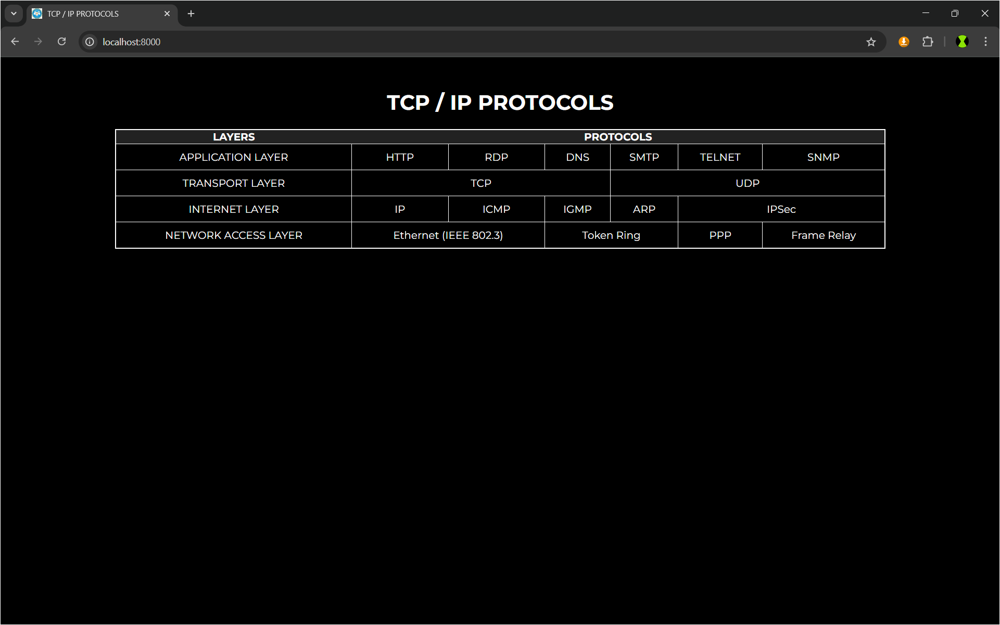

# EX01 Developing a Simple Webserver
### Date: 13/04/2025

## AIM:
To develop a simple webserver to serve html pages and display the list of protocols in TCP/IP Protocol Suite.

## DESIGN STEPS:
### Step 1: 
HTML content creation.

### Step 2:
Design of webserver workflow.

### Step 3:
Implementation using Python code.

### Step 4:
Import the necessary modules.

### Step 5:
Define a custom request handler.

### Step 6:
Start an HTTP server on a specific port.

### Step 7:
Run the Python script to serve web pages.

### Step 8:
Serve the HTML pages.

### Step 9:
Start the server script and check for errors.

### Step 10:
Open a browser and navigate to http://127.0.0.1:8000 (or the assigned port).


## PROGRAM:
Developed by : **KABELAN G K**

Reg no : **21222411027**
```
from http.server import HTTPServer, BaseHTTPRequestHandler
content = """
<!DOCTYPE html>
<html lang="en">
<head>
    <title>TCP / IP PROTOCOLS</title>
    <link rel="icon" href="https://encrypted-tbn0.gstatic.com/images?q=tbn:ANd9GcRFP9zs1zRTbw-P-Osmmg5hqaGtWJi0gNHASCbw8ycJlnm1K3AI_HRqAUtA06erx9X4SQA&usqp=CAU">
    <style>
        @import url('https://fonts.googleapis.com/css2?family=Montserrat:ital,wght@0,100..900;1,100..900&display=swap');
        body {
            background-color: black;
            color: white;
            font-family: 'Montserrat', sans-serif;
            padding: 20px;
            text-align: center;
        }

        table {
            border: 2px solid white;
            border-collapse: collapse;
            margin: 0 auto;
            width: 80%;
        }

        th {
            background-color: #222;
        }

        tr,td{
            align-items: center;
            margin: 5px;
            padding: 5px;
        }
        td:hover{
            background-color: #222;
        }
        td{
            border: 1px solid white;
            margin: 10px;
            padding: 10px;

        }
        

    </style>
</head>
<body>
    <h1>TCP / IP PROTOCOLS</h1>
    <table>
        <tr>
            <th>LAYERS</th>
            <th colspan="6">PROTOCOLS</th>
        </tr>
        <tr>
            <td>APPLICATION LAYER</td>
            <td>HTTP</td>
            <td>RDP</td>
            <td>DNS</td>
            <td>SMTP</td>
            <td>TELNET</td>
            <td>SNMP</td>
        </tr>

        <tr>
            <td>TRANSPORT LAYER</td>
            <td colspan="3">TCP</td>
            <td colspan="3">UDP</td>
        </tr>
        <tr>
            <td>INTERNET LAYER</td>
            <td>IP</td>
            <td>ICMP</td>
            <td>IGMP</td>
            <td>ARP</td>
            <td colspan="2">IPSec</td>
        </tr>
        <tr>
            <td>NETWORK ACCESS LAYER</td>
            <td colspan="2">Ethernet (IEEE 802.3)</td>
            <td colspan="2">Token Ring</td>
            <td>PPP</td>
            <td>Frame Relay</td>
        </tr>
    </table>
</body>
"""
class myhandler(BaseHTTPRequestHandler):
    def do_GET(self):
        print("request received")
        self.send_response(200)
        self.send_header('content-type', 'text/html; charset=utf-8')
        self.end_headers()
        self.wfile.write(content.encode())
server_address = ('',8000)
httpd = HTTPServer(server_address,myhandler)
print("my webserver is running...")
httpd.serve_forever()
```


## OUTPUT:
Refer to the following image to view the output of the program.



Terminal


## RESULT:
The program for implementing simple webserver is executed successfully.
